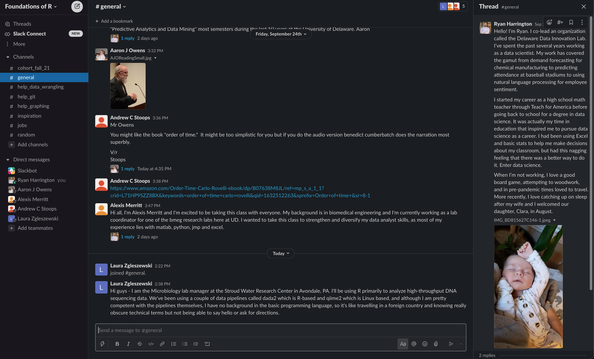

```{r setup, include=FALSE}
options(htmltools.dir.version = FALSE)
knitr::opts_chunk$set(
  fig.width=9, fig.height=3.5, fig.retina=3,
  out.width = "100%",
  cache = FALSE,
  echo = TRUE,
  message = FALSE, 
  warning = FALSE,
  fig.show = TRUE,
  hiline = TRUE
)
```

```{r libraries, include=FALSE, warning=FALSE}
if(! require(pacman)) install.packages("pacman")

pacman::p_load(
  tidyverse,
  here,
  xaringan,
  xaringanthemer,
  emo,
  gt,
  gargle,
  googlesheets4,
  ggtext
)

googlesheets4::sheets_auth(
  cache = ".secrets",
  email = "ryanh@udel.edu"
)
```


```{r xaringan-themer, include=FALSE, warning=FALSE}
library(xaringanthemer)
style_duo_accent(
  primary_color = "#006096",
  secondary_color = "#006096",
  inverse_header_color = "#FFFFFF"
)
```

class: animated, fadeIn, content-slide
layout: true

---

class: title-slide, middle
layout: false

# Foundations of R for Data Analysis

### Week 01: Understanding the R Programming Environment

Ryan Harrington<br>
September 27, 2021<br>
University of Delaware<br>
College of Professional & Continuing Studies


---

class: content-slide

# Hi, I'm Ryan `r emo::ji("wave")`

.pull-left[

]

.pull-right[
### Delaware Data Innovation Lab
Associate Director, Stategy & Operations

### CompassRed
Lead Data Scientist

### Open Data Delaware
Co-founder, Co-organizer
]

---

class: content-slide

# Course Goals

> In this course, students will learn to utilize the R programming language in order to perform data analysis in a work context. They will understand how to perform an exploratory data analysis with a focus on the tidyverse. In addition, students will understand tools that are necessary to perform these analyses in the workplace including git and R Markdown.

---

class: content-slide

# Course Goals

> In this course, students will learn to utilize the R programming language in order to perform data analysis in a work context. They will understand how to perform an .text-highlight[exploratory data analysis with a focus on the tidyverse]. In addition, students will understand tools that are necessary to perform these analyses in the workplace including git and R Markdown.

--

<br>
.center[]

---

class: content-slide

# Course Goals

> In this course, students will learn to utilize the R programming language in order to perform data analysis in a work context. They will understand how to perform an exploratory data analysis with a focus on the tidyverse. In addition, students will understand tools that are necessary to .text-highlight[perform these analyses in the workplace including git] and R Markdown.

--

.pull-left[<br><br>]

.pull-right[<br><br><br>]

---
class: content-slide

# Weekly Topics
.pull-left[
1.    Understanding the R Programming Environment

2.    Introduction to Exploratory Data Analysis

3.    Introduction to the tidyverse

4.    Data cleaning tools

5.    Joining & Reshaping Datasets

6.    Creating Functions

7.    Manipulation of Strings, Factors, and Datetimes

8.    Functional Programming]

.pull-right[

]

---

class: content-slide

# Course Syllabus

You can read the full course syllabus [here](https://udel.instructure.com/courses/1595325/assignments/syllabus).

Key things we'll cover:

- Expectations

- Grading

- Project

- Systems

---

class: content-slide

# Course Syllabus

## Expectations

--

-   **Attendance is required for this course.** However, if you're going to miss a session, please let me know. There will be a recording made available for you to review. This will allow you to still receive credit for your attendance.

--

-   **We'll always get started at exactly 6:00 pm.**
    -   We'll take a **15 minute break** approximately halfway through each week's session based upon when we reach a convenient stopping point.
    -   We'll **wrap up at 9:15 pm** each evening.

--

-   **Keep your videos on!**

---

class: content-slide

# Course Syllabus

## Grading

```{r, echo=FALSE}
assessment <- c("Attendance", "Assignments", "Project", "Total")
percent <- c(0.25, 0.5, 0.25, 1)
points <- c("40 points (5 points/week)", "80 points (10 points/assignment)", "40 points (for one project)", "160 points total")


data.frame(Assessment = assessment,
           Points = points,
           Percent = percent) %>% 
  gt() %>% 
  fmt_percent(columns = Percent,
              drop_trailing_zeros = T) %>% 
  cols_align(align = "left",
             columns = c("Assessment", "Points")) %>% 
  cols_width(Assessment ~ px(150),
             Percent ~ px(75),
             Points ~ px(250)) %>% 
  tab_options(heading.background.color = "#006096",
              heading.title.font.weight = "bold",
              table.font.names = "Roboto",
              row.striping.background_color = NULL)
```

---

class: content-slide

# Course Syllabus

## Project

25% of your grade will come from the completion of a project.

-   Due one week after your last class, 11/22/21
-   Completed individually

You will select your own dataset(s), generate a question that you want to answer, and complete the analysis using R.

The final output will be as a knitted HTML file hosted via GitHub pages.

---

class: content-slide

# Course Syllabus

## Systems

**Canvas**
-   Grades
-   Course documents
-   Recordings

**GitHub**
-   Assignments posted
-   Assignment submissions

**Slack**
-   Course communication
---

class: content-slide, middle

.center[# Who is in this course?]

---

class: content-slide

# Who is in this course?

```{r, echo=FALSE, fig.alt="Bubble chart demonstratign skill level of participants in the Foundations of R course", out.width="100%"}
# Note: you will not be able to replicate this code without access to this file.
intro <- read_sheet("https://docs.google.com/spreadsheets/d/13Ue0fEP8km13dN1JKm_BQ4b6186XxBNfzNHQkMdjzZE/edit?resourcekey#gid=1083356295")

tool_levels <- factor(c("Excel (or a similar spreadsheet tool)", "SQL", "SPSS, JMP, Stata or similar statistics modeling tools", "git", "R", "Another programming language", "Descriptive statistics", "Statistical modeling techniques", "Machine learning techniques"))

skill_levels <- factor(c("No experience", "Basic", "Intermediate", "Advanced"))

intro %>% 
  select(starts_with("Please indicate your skill")) %>% 
  pivot_longer(cols = everything(),
               names_to = "Tool",
               values_to = "Level") %>% 
  mutate(Tool = str_extract(Tool, "\\[.+\\]"),
         Tool = str_remove_all(Tool, "[\\[\\]]"),
         Tool = factor(Tool, levels = tool_levels),
         Tool = fct_rev(Tool),
         Level = factor(Level, levels = skill_levels)) %>% 
  count(Tool, Level, sort = T) %>% 
  ggplot(aes(x = Level,
             y = Tool,
             size = n)) +
  geom_point(color = "#006096") +
  scale_x_discrete(position = "top") +
  labs(x = "",
       y = "",
       title = "<b>Skill Level of Foundations of R Course Participants</b>",
       subtitle = glue::glue("As of <i>{format(Sys.Date(), format = '%B %e, %Y')}</i> at <i>{format(Sys.time(), format = '%I:%M %p')}</i>")) +
  theme_minimal() +
  theme(legend.position = "none",
        plot.title = element_markdown(),
        plot.subtitle = element_markdown(),
        axis.text.x = element_text(face = "bold"))
```


---

class: title-slide, middle, center
layout: false

# R was invented by statisticians,<br> for statisticians

---

class: content-slide

# How do you learn to program?

--
### Focus on identifying projects thats you care about
The work becomes much more meaningful to solve when you have specific questions that you're focused on answering. Also, if you're looking for a new job, it helps you to build a portfolio.

--
### Identify and develop a community to support you
One of R's strengths is its community. There are a lot of places you can find one - from Twitter to Slack. We'll build one in our classroom via Slack that extends beyond our time in the classroom together.

--
## Learn how to ask for help
It's challenging to know what to do when you encounter an error or a warning as you first get started. Every issue that you have to solve is a new issue. We'll aim to explicitly teach how to Google your way out of issues throughout this course.
---

class: content-slide

# Why R?

.pull-left[
## Strengths
-   Free & Open Source philosophy (originally [GNU General Public License](https://www.r-project.org/Licenses/))

-   Strong graphics and visualization capabilities

-   Historically strong community
]

.pull-right[
## Weaknesses
-   Different paradigms from other programming languages (indexing at 1)

-   Memory hog

-   No particular group is in charge of development across R 
]

---

class: content-slide

# A Magical Partnership

.pull-left[

## The Language

-   Can be run independently of any other computer program
-   R may be used without RStudio]

.pull-right[

## The IDE

-   A development environment designed to be used alongside R
-   RStudio may not be used without R]

---

class: content-slide

# The RStudio Environment

.center[]

---

class: content-slide

# Creating your first file

## R Scripts vs RMarkdown

For our course, we'll be primarily working with **RMarkdown** files.

-   R scripts and RMarkdown files can both run the same code
-   R scripts (file extension: `.R`) are great for building code that is part of a larger system
-   RMarkdown files (file extension: `.Rmd`) are great for creating reports. This presentation is created with RMarkdown. They allow narrative, code, and output to be intermingled.

---

class: content-slide

## Parts of a RMarkdown file

.pull-left[
-   **YAML Header**
    -   Only occurs once at the top of the document
    -   Allows you to specify metadata and dictate document-wide formatting options

-   **Markdown**
    -   Text that is not evaluated as code
    -   Basic formatting of text is possible, from **bolding** and *italicizing* text to utilizing lists
    -   It is possible to include `code` inline with the markdown that will be evaluated when the document is “knit". For example: `r Sys.Date()`]

.pull-right[
-   **Code Chunks**
    -   Actual code
    -   Each chunk can be evaluated independently
    -   It is possible to use a variety of languages beyond R in the chunks

-   **Output**
    -   Output from the code chunks are included immediately below the chunk
    -   This allows for easier exploration]

---

class: content-slide

# Basic Functionality

## Creating a chunk

"Chunks" are where we write executable code in an R Markdown file. You can insert a chunk in one of several ways:

-   Click the green  button in the source pane
-   Go to `Code > Insert chunk`
-   Use the shortcut `option + command + i`


```{r}

```

Chunks will always be surrounded by three back tick marks. The type of code that will be run in the chunk will be designated inside of the `{}`. In this course, we will always utilize `r`, though many other options are available (but not as feature rich as R). It is always required to include the language for the chunk.

Inside the `{}`, you can specify other information as well. For example, we can name our chunk. We can also provide options for how the chunk should be handled when we knit the document. We'll talk about that more later. Here are some examples:

---

class: content-slide

# Using R as a calculator

One of the absolute most basic functions for R is to use it as a calculator. You can perform all of the basic functions that you might expect to with R - from addition to division. Insert a new chunk. Let's start with some basic addition.

There are **many** ways which you can execute your code.

Here are two:

-   Run the full chunk by pressing the green arrow
-   Run the full chunk by using the short cut `command + shift + enter`

```{r, eval=FALSE}
2 + 4
```

--

It is a best practice in R to include spaces around operators. It dramatically increases the readability of your code. Your code will still execute without spaces, though.

```{r, eval=FALSE}
1-4
```

---

class: content-slide

# Using R as a calculator

All of your other operators work as you'd expect:

-   `+` for addition
-   `-` for subtraction
-   `*` for multiplication
-   `/` for division
-   `()` for...parentheses

Notice what the output look like when you run the whole chunk.

```{r, eval=FALSE}
7 * 2
9 / 3
8 + 4 - 3
6 / (1 + 2)
```

---

class: content-slide

# Running Code

We can our code in many ways besides simply running the full chunk.

-   We can run a single line by using `command + enter`

-   We can run an arbitrary amount of code by highlighting or "painting" the relevant code. That could mean:

    -   A single line
    -   Multiple lines
    -   A portion of a line

```{r, eval=FALSE}
7 * 2
9 / 3
8 + 4 -3
6 / (1 + 2)
```

---

class: content-slide

# Commenting code

One of the most valuable things that you can do with your code is to leave comments throughout it. These serve as notes for other people reading your code to understand your work...including **future you**.

In R, we comment by using the `#` symbol. Anything following a `#` is considered a comment and is not executed.

```{r, eval=FALSE}
# I am a comment
# This text will not be executed

3 + 7
# 3 + 7
3 + 7 # here's a comment as well
```

---

class: content-slide

# Logical conditions (Booleans)

In order to build scripts in the future you will need to understand how to utilize logical conditions. Logical conditions will evaluate to `TRUE` or `FALSE`.

There are many ways to evaluate logical conditions, but we can start with some basics - tests of inequality or equality.

--

```{r, eval=FALSE, error = TRUE}
3 < 5

# When writing >= or <=, the equal sign always follows the symbol
4 >= 6

# This will give you an error. Why?
4 => 6

# Note that when evaluating equivalency, we utilize two equal signs
1 == 2

7 ^ 2 >= 2 ^ 6 - 4 ^ 2
```

---

class: content-slide

# Object assignment

Another fundamental skill you need to understand is how to assign values to objects. By assigning values to objects, we can recall them later.

To do this, we utilize `<-`

```{r}
value <- 6 + 3
```

Notice that there is no output when we run this chunk. Let's go check our Environment pane to see what happened, though.

Notice that an object called `value` is now included in our environment. That means that we are able to re-use the object for future calculations. The Environment pane includes some helpful metadata about our newly created object including:

-   Name
-   Type
-   Length
-   Size
-   Value

---

class: content-slide

# Object assignment

We can now use our newly created object `value`.

```{r, eval=FALSE}
value + 3

value ^ 2

value / 3 == sqrt(value)
```

---

class: content-slide

# Object assignment

While in most cases in `R`, adding in spaces will not impact the executability of our code, this is one specific instance where we need to be very careful with our spacing. Observe what happens now.

```{r, error = TRUE}
# Underscores and periods are valid for naming!
new_value < - 8 - 7
```

--

Consider what is happening with this error. `R` does not recognize that there should be an assignment operator being used due to the space between the `<` and the `-`. Instead of viewing them together as `<-`, the `R` compiler is viewing each separately and trying to evaluate the `<` as a logical operator and `-` for subtraction. Because there is no assignment arrow, `R` searches the environment for an object named `new_value`, which, of course, does not exist. That leads to our error.

You'll note that this is fixed by simply removing the space between `<` and `-`.

```{r}
new_value <- 8 - 7
```

---

class: content-slide

# Object assignment

`<-` is not the only valid way of assigning objects in your global environment. The `=` symbol is an equivalent way of assigning objects, but it is not considered a best practice to utilize it. Note that this will work:

```{r}
# Yes, you can begin names of objects with a period
# There is no difference between objects that have names that start with periods
# and those that don't, however, it is somewhat uncommon.
.a_really_new_value = 8.675309
```

We can put this all together, quite literally.

```{r, eval=FALSE}
value - new_value + .a_really_new_value
```

---

class: content-slide

## Creating vectors with the : operator

We are rarely going to work with single numbers in the way that we have so far. Rather, we are likely to work with **many** numbers.

A simple way to start doing that is with the colon operator, `:`. The `:` operator will generate the numbers `from:to`.

```{r, eval=FALSE}
1:10

21:72

10:1

-3:-8
```

--

Just like with operations, we can store these values to objects for use later.

```{r}
top_ten <- 1:10

top_ten_reversed <- 10:1
```

---

class: content-slide

# Concept: Operations are vectorized

Why is this useful?

Because now we can perform operations on **all of these numbers at the same time**.

```{r, eval=FALSE}
top_ten - 8

top_ten / 2

top_ten == 8
```

--

This leads us to a major takeaway. `R` is considered a **vectorized** programming language. It was written to excel at performing the same operation on many values simultaneously. 

In other programming languages, like Python, the task of subtracting 8 from every number in a list is less straightforward. In R, this is extremely simple.

---

class: content-slide

# Built-in Functions

So far we have utilized extremely basic operators to do our work. `R` has many more complicated functions built in, though.

Functions are pre-written code that you can utilize to make your work easier. We'll be using many, many functions throughout this course. Later on, we'll be writing our own functions.

We'll start with some simple functions that you can utilize for calculator purposes.

```{r, eval=FALSE}
# Take the square root of a number
sqrt(3)

# Take the absolute value of a number
abs(-2)
```

---

class: content-slide

# Built-in Functions

These, of course, can also work with lists.

```{r, eval=FALSE}
sqrt(top_ten)

# This one is maybe a little bit boring...
abs(top_ten)

# All of your basic stats...
mean(top_ten)
median(top_ten)
min(top_ten)
max(top_ten)
sd(top_ten)
var(top_ten)
```

---

class: content-slide

### ?, help, and Vignettes

You are absolutely not expected to know every function and how it works. For that reason, one of the most important tools in your toolset is **documentation**. You can find documentation in many places, but the easiest place to find it is right in your console.

The page where your documentation is listed is referred to as a **vignette**. 
-   Vignettes include all of the information that you need in order to utilize a function
-   The fastest way to access your vignette is by using `?`
-   Use the `?` immediately before the name of the function that you want to learn more about

Let's see what the vignette looks like for the `mean` function. We can do this by typing `?mean` into our console.

```{r, eval=FALSE}
?mean
```

It is equivalent to type `help("mean")` as well.

```{r, eval=FALSE}
help(mean)
```

---

class: content-slide

# Creating vectors with the `c` operator

The `:` operator is excellent for creating sequences of numbers that increase or decrease by 1. We may want to create a sequence of numbers that are not sequential though. For that, we can use the `c` function.

```{r}
lost_numbers <- c(4, 8, 15, 16, 23, 42)

jennys_number <- c(8, 6, 7, 5, 3, 0, 9)

transcendental_numbers <- c(pi, 1.618, 2 * pi, 2.718)
```

---

class: content-slide

# Creating vectors with the `c` operator

We are not limited to combining individual numbers. We can also add in sequences. For example:

```{r}
new_sequence <- c(1:10, 8, 6, 7 , 5, 3, 0, 9)
```

--

Unsurprisingly, we can also combine previously defined sequences of numbers using the `c` function.

```{r}
all_sequences <- c(lost_numbers, transcendental_numbers, top_ten)
```

--

It is important to note that the `c` operator coerces all of the objects in our vector to have the same type. You'll notice that all of the numbers include decimals - even those that are integers. The documentation for `c` gives more details about this behavior. We'll also discuss this in more depth later.

---

class: content-slide

# Function Arguments

So far, we have worked with a few simple functions. These have been relatively simple to work with so far. For example, we worked with `mean` by passing a list of numbers to it and it performs the calculation for us, like so: `mean(all_sequences)`.

For many functions, we need to specify additional **arguments** that tell the function what we want it to do. Sometimes these are required. Sometimes they are optional. Sometimes they have default values. Sometimes we need to supply our own values.

---

class: content-slide

# Function Arguments

Let's explore this by looking at the `seq` function.

This function does exactly what you think it might do based upon the name. It generates a sequence of numbers. We have done this already with the `:` operator, but we were limited to sequences of numbers that increase or decrease by 1. The `seq` function provides us with more flexible options.

---

class: content-slide

# Function Arguments

Let's see how by pulling up the vignette for the `seq` function.

First, let's zero in on the *Arguments* section of the vignette. Arguments are your way of communicating with a function to tell it what to do. These are the inputs that allow you to change your function outputs.

The arguments section of a vignette provides a description for each argument and how to use it. For `seq`, there are 5 arguments:

-   `from`
-   `to`
-   `by`
-   `length.out`
-   `along.with`

You'll also notice the `...` argument. This is a special argument that is used in many functions. We'll spend more time talking about this later in the course. For now, we'll concentrate on the other arguments in `seq`.

---

class: content-slide

# Function Arguments

If you take a look back at the *Usage* section of the vignette. This tells us the default values that are being provided to the function.

```
seq(from = 1, to = 1, by = ((to - from)/(length.out - 1)), length.out = NULL, along.with = NULL, ...)
```

Notice that the `from` and `to` arguments default to `1`. The `by` argument has a formula detailing it's default. The `length.out` and `along.with` arguments are `NULL` by default.

Let's start using these arguments to get an understanding of how functions work.

---

class: content-slide

# Function Arguments

First, we can use `seq` exactly like the `:` operator.

```{r, eval=FALSE}
seq(2, 10)
```

Notice that we did not specify any argument names here. If we do not specify argument names, then `R` interprets them in the order of the arguments.

-   `from` is the first argument for `seq`, so `2` is interpreted as the value for `from`
-   `to` is the second argument for `seq`, so `10` is interpreted as the value for `to`

---

class: content-slide

# Function Arguments

We did not have to specify values for anything else. `R` used the default values for those arguments in order to generate the sequence.

I typically prefer to be explicit about which arguments I am using, particularly when creating scripts that will be shared with others. Even when not sharing my script with others, explicitly naming my arguments often helps future me remember what my code does.

This is equivalent to our previous code, except it explicitly names the arguments.

```{r, eval=TRUE}
seq(from = 2, to = 10)
```

Our output is, as expected, exactly the same.

---

class: content-slide

# Function Arguments

As we mentioned, when we explicitly name arguments, we are not beholden to the order that the arguments are listed in by default. For example, notice that when we reverse the order of `from` and `to`, we end up with the same output.

```{r, eval=FALSE}
seq(to = 10, from = 2)
```

--

We can change our output by changing additional arguments. For example, perhaps we want our sequence to increase by `2` instead of by `1`. We can make use of the `by` argument to do this.

```{r, eval=FALSE}
seq(from = 2, to = 10, by = 2)
```

The `seq` function has many different usages. Read the vignette to get a better understanding for what it is able to do. There are several related functions to `seq` that are essentially just specialized versions of it. They have been optimized for specific use cases and, therefore, are very useful when you come across those specific situations.

---

class: content-slide

# Data types

So far, we've worked with a variety of numbers in our exercises. There are different *kinds* of numbers, though. Beyond that, we may not always work with numbers. There are 6 basic data types. In this course, we'll use 4 of the data types consistently. In fact, we've already touched on 3 of them. The six data types are:

-   Numeric (doubles)

-   Numeric (integers)

-   Logical

-   Character

-   Complex

-   Raw

Beyond these six data types, there are a bevy of other data types that you'll be introduced to. These additional data types are all, ultimately, built on top of the six presented here.

---

class: content-slide

# Data types

## Numeric (doubles)

We have worked with numbers quite a bit already, so it makes sense that one of the default types would be **numeric**. 

In `R`, if something is "numeric", then it refers to anything that is a number. However, we can actually be more specific than this. Values that include decimals are referred to as **doubles**.

Doubles get their name from how computers store numbers in memory. You can read more about that [here](https://en.wikipedia.org/wiki/Double-precision_floating-point_format).

---

class: content-slide

# Data types

## Numeric (integers)

**Integers** are also a more specific type of double. These are any numeric values that do not have decimals. `R` does work behind the scenes to make a best guess as to whether or not you intend to work with doubles or with integers unless you explicitly coerce your values to be one or the other.

Consider the differences between two lists of numbers that we made earlier: `lost_numbers` and `transcendental_numbers`.

There are a range of functions that help us to understand and work with our data types. We'll be using some of those to explore the differences between these sets of numbers.

---

class: content-slide

# Data types

## Numeric (integers)

First, let's look at `lost_numbers`. We know that integers do not have decimals and doubles do have decimals. We can check the type of data in the list with the cleverly named `typeof` function.

```{r, eval=FALSE}
typeof(lost_numbers)
```

Interestingly, `R` has guessed that this list is of type `double`.

---

class: content-slide

# Data types

## Numeric (integers)

Another way to see this is by using one of the `is.*` functions. This set of functions answers the question "is this object of the type that I am checking it against?" So for example `is.double` would check if an object is a double and `is.integer` would check if an object is an integer. `is.numeric` is a bit of a special function that will return `TRUE` if the object is either a double or an integer.

```{r, eval=FALSE}
is.double(lost_numbers)
is.integer(lost_numbers)
is.numeric(lost_numbers)
```

---

class: content-slide

# Data types

## Numeric (integers)

Related to the `is.*` functions are the `as.*` functions. Instead of checking for a specific data type, the `as.*` functions coerce values into the data type that you specify. For example, we could coerce our `lost_numbers` object into a integers as opposed to doubles.

```{r, eval=FALSE}
# We're going to overwrite our original object
lost_numbers <- as.integer(lost_numbers)

# We can demonstrate that lost_numbers has been coerced to integers
typeof(lost_numbers)
is.integer(lost_numbers)

# And, of course, it is still TRUE that the object is numeric
is.numeric(lost_numbers)
```

---

class: content-slide

# Data types

## Numeric (integers)

The `is.*` and `as.*` are extremely useful functions that you will use many times as you solve problems with `R`.

What if you wanted to explicitly define a list of numbers as integers as opposed to needing to coerce your values using the `as.integer` function? How could you differentiate between `1` as a double and `1` as an integer?

To do that, you you can use the suffix `L`.

```{r, eval=FALSE}
is.integer(1)
is.integer(1L)

typeof(1L:10L)
typeof(1:10L)
typeof(1L:10)
```

---

class: content-slide

# Data types

## Logical

We have worked with logical values every time we evaluated a conditional statement. Logicals are `TRUE` and `FALSE`.

```{r}
set.seed(112)
random_logicals <- runif(137, 0, 1) < .5
```
```{r, eval=FALSE}
typeof(random_logicals)
is.logical(random_logicals)
```

---

class: content-slide

# Data types

## Logical

A very convenient property of `TRUE` and `FALSE` is that they evaluate to `1` and `0` respectively. That means that we can do things like:

```{r, eval=FALSE}
sum(random_logicals)
mean(random_logicals)
```

---

class: content-slide

# Data types

## Logical

In fact, notice what happens when we apply the `as.integer` function to `random_logicals`.

```{r}
as.integer(random_logicals)
```

---

class: content-slide

# Data types

## Character

So far, we have only worked with values that are either logical or numeric. However, data is very frequently communicated with **characters**. These are often referred to as **strings** as well. We will spend more time focused on working with these data types in later weeks of the course. For now, it is helpful to know how to identify them.

An object is considered a character when it is encapsulated by quotation marks. For example, `"September"` would be considered a character.

```{r, eval=FALSE}
months_of_the_year <- c("January", "February", "March", "April", "May", "June",
                        "July", "August", "September", "October", "November", "December")

typeof(months_of_the_year)
is.character(months_of_the_year)
```

---

class: content-slide

# Data types

## Character

We previously mentioned the idea of "coercion" - one data type being forced into another. The character data type is the end of the road for coercion:

`logical` → `integer` → `numeric` → `character`

---

class: content-slide

# Data types

## Complex

If you remember back to you algebra coursework in high school, you will recall working with imaginary numbers ($i =\sqrt{-1}$) and then, eventually, complex numbers($z = a + bi$). Complex numbers are numbers that include a real and imaginary part. We will not be working with complex numbers in this course, though they are extremely important to understand for specific industries.

```{r, eval=FALSE}
complex_numbers <- c(1 + 2i, 3 - 4i, -5 + 6i, -7 - 8i)

typeof(complex_numbers)
is.complex(complex_numbers)

# Another way to do it create complex numbers
complex(real = 1, imaginary = 2)
```

---

class: content-slide

# Data types

## Raw

The last data type is one that we will almost certainly not work with in this course - **raw**. As it sounds, the raw data type refers to raw bytes of data. I have had to utilize the raw data type one time in the years that I have utilized `R`. Specifically, it helped me to ingest data that included strange encodings because it came from a foreign country. Converting it to raw allowed me to bypass an error that I had encountered.

The output of these functions are the literal hexadecimal values that your computer is using to store the values in memory.

```{r, eval=FALSE}
as.raw(40)

charToRaw("A test string")
```

---

class: content-slide

# Data structures

When discussing the `c` function, we briefly discussed **vectors** and **lists**. These are two of the data structures that you will become comfortable working with while coding with R.

Generally, you can think of data structures as the intersection of two ideas: **dimensionality** and **heterogeneity**.

| Dimensionality | Homogeneous   | Heterogenous |
|----------------|---------------|--------------|
| 1D             | Atomic vector | List         |
| 2D             | Matrix        | Data frame   |
| ND             | Array         |              |

In this course, you will frequently work with vectors, lists, and data frames. We will not work with matrices or arrays.

---

class: content-slide

# Data structures

## Vectors

Vectors are collections of values that are all of the same data type. When we consider dimensionality and heterogeneity, we could describe vectors as being 1-dimensional, homogenous objects. This is the most basic data structure in `R`. You used a vector every time you used the `:` operator or the `c` function.

```{r, eval=TRUE}
dbl_vec <- c(2, 3, 2.5, 9, 7.3)
int_vec <- 1L:7L
log_vec <- c(TRUE, FALSE, T, F)
chr_vec <- c("I", "can't", "believe", "it's", "not", "butter")
```
```{r, eval=FALSE}
typeof(dbl_vec); is.atomic(dbl_vec)
typeof(int_vec); is.atomic(int_vec)
typeof(log_vec); is.atomic(log_vec)
typeof(chr_vec); is.atomic(chr_vec)
```

---

class: content-slide

# Data structures

## Vectors

If we concatenate multiple vectors together, then we still end up with a 1-dimensional object. The vectors are "flattened" together.

```{r}
concat_vec <- c(dbl_vec, top_ten)
```

--

This flattening will also occur when we have vectors of different data types. The data type of the final vector will be dictated by the coercion rules discussed previously.

```{r}
coerce_vec <- c(log_vec, dbl_vec)
coerce_vec_again <- c(log_vec, chr_vec)
coerce_yet_again <- c(dbl_vec, log_vec, int_vec, chr_vec)
```

---
class: content-slide

# Data structures

## Lists

Lists are similar to vectors with one major exception - they can contain multiple data types as opposed to only a single data type. They are 1-dimension, heterogenous objects.

```{r}
combined_list <- list(log_vec, dbl_vec)
combined_list_again <- list(log_vec, chr_vec)
combined_yet_again <- list(dbl_vec, log_vec, int_vec, chr_vec)
```

--

One other major difference between lists and vectors is that lists can be *recursive*. By that, we mean that lists can contain lists...which themselves can contain lists...which themselves can contain lists...ad infinitum.

```{r}
recursive_list <- list(combined_list, 1:10)

more_recursive_list <- list(combined_list, combined_list_again, combined_yet_again, recursive_list)
```

---

class: content-slide

# Data structures

## Matrices

Moving up a level of dimensionality brings us to matrices. Matrices are similar to vectors in that they can only include data of a single type. The difference is that they are 2-dimensional as opposed to 1-dimensional.

Matrices are extremely important for predictive analytics, machine learning, and artificial intelligence. They are the backbone of all of these skillsets. We will not be working with matrices in this course, but it is important to understand that they exist.

```{r}
one_hundred_matrix <- matrix(1:100, nrow = 10, ncol = 10)
```

---

class: content-slide

# Data structures

## Data frames

Data frames are the bread and butter of the work that we will be doing in this course. These are 2-dimensional, heterogenous data structures. From a practical perspective, data frames are composed of multiple vectors of the same length.

```{r, error=TRUE}
months_df <- 
  data.frame(months = months_of_the_year,
             month_number = 1:12)
```

---

class: content-slide

# Data structures

## Data frames

One of the most common mistakes that people make when getting started with working with data frames is that they will try to use vectors of different lengths to create a data frame.

```{r, error=TRUE}
data.frame(months = months_of_the_year,
           month_number = 1:11)
```

---

class: content-slide

# Basic Project Workflow

You've created your first R markdown file. Now you need to start thinking about workflows to make your code repeatable. The absolute most basic way to do that is by saving your code.

## Saving files

Saving in `R` works just like it does in nearly any other program or application that you've used. You can go to `File > Save` or `File > Save As...` in your menu. You can also use the appropriate shortcut to save, `⌘ + S`. Your R markdown files will automatically have the extension of `.rmd` while your R script files will automatically have the extension of `.R`.

---

class: content-slide

# Basic Project Workflow

## Saving files

The mechanics of saving files in `R` are not complicated. There are some best practices for naming your files, though:

-   Give your files meaningful names! You want to future proof your files with meaningful names so that you or your colleagues can get a sense of what they do in the future.

-   Avoid spaces in file names. They work, but you're best off using `-` or `_` in their place. This will make some small things easier later.

-   If your files are part of a sequence, give them numeric prefixes to indicate the order. Much better to call your files `01_load_packages.R` than just `load_packages.R`. Once again, you'll be making life easier for you and your colleagues in the future.

---

class: content-slide

# Basic Project Workflow

## Creating projects

Each time you do work with `R`, you'll want to consider utilizing the concept of a "project" to organize your code. `.Rproject` files are a simple text file that you add to the root of the directory where you are storing your work. This is a simple way to tell `R` that *this* is where your work starts. This will be extremely helpful later on as your work grows in complexity.

You can add a `.Rproject` file by navigating to `File > New project`. There are plenty of options for how to set up your projects. We'll worry about that later.

---

class: content-slide

# Git

**Think of git as being like an extremely slow, intentional version of a Google document.**

- Git is a version control system that gives you control over different versions of your code.
- In some ways, Git is to GitHub as R is to RStudio.

Git is the number one thing on my list of "stuff I wish I knew before I started working". It is a separate skill from `R`, but one that makes working with a team *much, much* easier.

.pull-left[<br><br>]

.pull-right[<br><br><br>]

---

class: content-slide

# Git

We'll spend more time throughout the course working with git and getting a better understanding for it.

As of now you should have:

-   Made a profile on [GitHub](GitHub.com)
-   Made sure that you have access to the GitHub repository for our course
-   Successfully installed git on your computer

We'll be using [*Happy Git and GitHub for the useR*](https://happygitwithr.com/) throughout this course to slowly grow our git skills.

---

class: content-slide

# Git

Tonight we'll do a few things to get you started with using git:

1. **Connect** your local machine to your remote account on GitHub
2. **Fork** your own version of the `week_01` homework repository
3. **Clone** the forked repository to your local machine

---

class: content-slide

# Git

## Remote vs. Local

.left-column[
**Remote repositories** are hosted on a server accessible by all team members. In our case, that's GitHub.

**Local repositories** reside on the computers of team members.
]

.right-column[]

---

class: content-slide

# Git

## `r emo::ji("handshake")` Introduce yourself to Git

We're following along with [Happy Git with R](https://happygitwithr.com/hello-git.html)

1. Open up your Terminal (Mac) or Git Bash (PC).

2. Enter the following commands:

```
git config --global user.name 'Jane Doe'
git config --global user.email 'jane@example.com'
git config --global --list
```

---

class: content-slide

# Git

## `r emo::ji("fork")` Fork a repository 

1. Navigate to our [course organization on GitHub](https://github.com/UD-PCS-Foundations-of-R-Fall-2021)

2. Go to the [`week_01`](https://github.com/UD-PCS-Foundations-of-R-Fall-2021/week_01) repository

3. Select `Fork` in the upper right hand corner

4. Select your personal profile to fork the code to. This is likely the only option you'll have!

5. A new version of the code repository will now exist on your personal GitHub account. It will be named `<your_user_name>/week_01`

6. You have successfully forked the repository!

---

class: content-slide

# Git

## `r emo::ji("sheep")` Clone the repository 

1. Determine where you want the repository to live on your local machine. I'd recommend the directory (aka "folder") that you'll be using for class.

2. We'll use basic Unix commands to navigate to this location by using Terminal (Mac) or Git Bash (PC).
    - Use `cd` to "change directories" and navigate to the appropriate repository.
    - Use `ls` to "list" the files and directories in your current folder. This can be extremely helpful!
    
3. On GitHub, navigate to the green `Code` dropdown button. Copy the link that it lists here.

4. Go back to your terminal. Type: `git clone <paste_the_link_you_just_copied>`

5. Voila! The code from the remote repository on GitHub should now exist as a local repository on your machine.

---

class: content-slide

# Closing Thoughts

## Homework

Your homework assignment should now be on your local machine.

Complete your assignment in the `Week_01_Assignment.Rmd` file.

In normal weeks, your homework will be due by 5:59 pm on the day of the next class (i.e., this would normally be due 10/4 at 5:59 pm).

For this week, we'll submit your assignment together at the beginning of the next class.

---

class: content-slide

# Closing Thoughts

## Slack

.pull-left[We'll be using Slack for communication throughout the course.

Slack is broken up into "channels", which you'll be able to see on the left hand side of the screen.

You can also direct message people - also on the left hand side of the screen.

If you're running into any git trouble - now or throughout the course - try leaving a message in the **`help_git`** channel.]

.pull-right[]

---

class: title-slide, middle
layout: false

# Foundations of R for Data Analysis

### Week 01: Understanding the R Programming Environment

Ryan Harrington<br>
September 27, 2021<br>
University of Delaware<br>
College of Professional & Continuing Studies